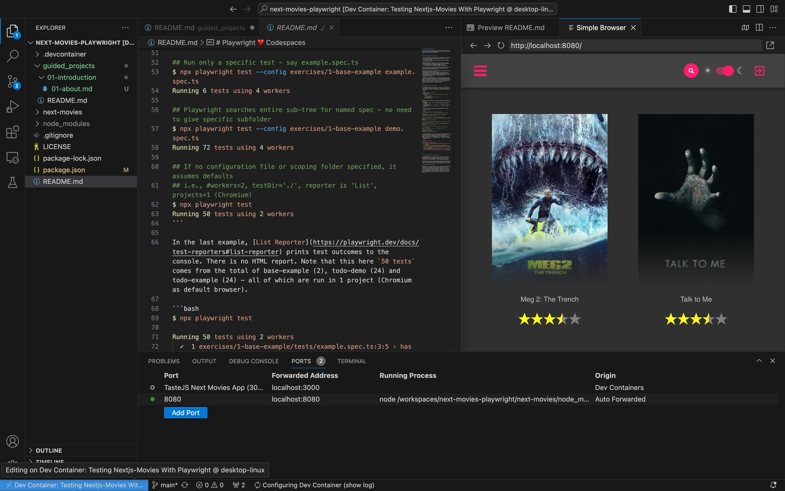

# Exercise: Validate App in GitHub Codespaces

## Open the Application in GitHub Codespaces

## Open the Application in Docker Desktop

1. Install Docker Desktop on your local device.
2. Click the Dev Container icon (bottom left) in VS Code
3. Select the "Rebuild Container Locally" option

